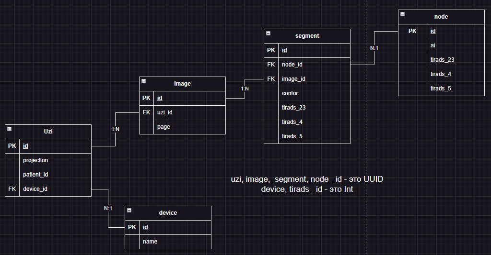

# Uzi service

цель сервиса - хранение отношений между узлами сегментами картинками в узи. Также сервис ответственнен за разбиение узи на подкартинки

## Сущности

Представлены на картинке: 

## Tech

### Сущности ручки

! _Пути для ручек - именование gRPC методов_

#### Device

Структура:
* id
* name

Обозначения:
    - device: id, name

+ /getDeviceList 
    - <- []device

+ /createDevice _private_ _testing_
    - -> name
    - <- id

#### Uzi

Структура:
* id
* projection
* patient_id
* device_id

Обозначения:
    - uzi: id, projection, patient_id, device
    - mutable: projection, patient_id, device

+ /createUzi
    - -> mutable
    - <- id

+ /updateUzi 
    - -> id + mutable
    - <- uzi

+ /getUzi
    - -> id
    - <- uzi

#### Image

Структура:
* id
* page
* uzi_id

Обозначения:
    - image: id, page

+ /getUziImages
    - -> uzi_id
    - <- []image

+ /getNodesWithSegmentsOnImage
    - -> id
    - <- []node{id, ai, tirads_23, tirads_4, tirads_5}, []segments{id, node_id, image_id, contor, tirads_23, tirads_4, tirads_5}

__Kafka__

+ uziUploaded
    - -> uzi_id
        * Выгрузить из S3
        * Split картинки
        * Загрузка каждой в S3
        * Сохранение в бд
        * Написание в event uziSplitted
            - -> uzi_id, []image_id

#### Segment
Структура:
* id
* node_id
* image_id
* contor
* tirads_23
* tirads_4
* tirads_5

Обозначения:
id, node_id, image_id, contor, tirads_23, tirads_4, tirads_5

+ /addSegment
    - -> node_id, image_id, contor, tirads_23, tirads_4, tirads_5
    - <- id

+ /delSegment
    - -> id

+ /updateSegment
    - -> tirads_23, tirads_4, tirads_5
    - <- id, node_id, image_id, contor, tirads_23, tirads_4, tirads_5

#### Node
Структура:
* id
* ai
* tirads_23
* tirads_4
* tirads_5

Обозначения:
id, ai, tirads_23, tirads_4, tirads_5

+ /createNode
    - -> ai, tirads_23, tirads_4, tirads_5 , []segments{ image_id, contor, tirads_23, tirads_4, tirads_5 }
    - <- id

+ /delNode
    - -> id

+ /updateNode
    - -> id, tirads_23, tirads_4, tirads_5
    - <- id, ai, tirads_23, tirads_4, tirads_5